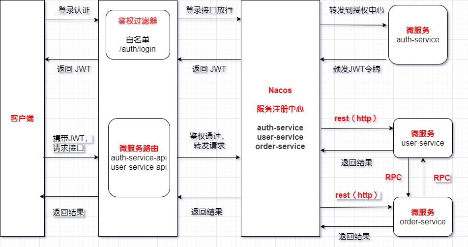

# Spring Cloud Alibaba Dubbo Examples

Spring Cloud Alibaba 组件学习。
> Spring Cloud Alibaba版本说明: [https://github.com/alibaba/spring-cloud-alibaba](https://github.com/alibaba/spring-cloud-alibaba/wiki/%E7%89%88%E6%9C%AC%E8%AF%B4%E6%98%8E)

1. 服务注册与发现
```xml
        <dependency>
            <groupId>com.alibaba.cloud</groupId>
            <artifactId>spring-cloud-starter-alibaba-nacos-discovery</artifactId>
        </dependency>
```

2. 配置中心 
```xml
        <dependency>
            <groupId>com.alibaba.cloud</groupId>
            <artifactId>spring-cloud-starter-alibaba-nacos-config</artifactId>
        </dependency>
```
3. 流量控制、熔断降级、系统负载保护
```xml
     <dependency>
         <groupId>com.alibaba.cloud</groupId>
         <artifactId>spring-cloud-starter-alibaba-sentinel</artifactId>
     </dependency>
```
4. 网关
```xml
        <dependency>
            <groupId>org.springframework.cloud</groupId>
            <artifactId>spring-cloud-starter-gateway</artifactId>
        </dependency>
```

**cloud-gateway**：网关服务，负责请求转发和鉴权功能，整合JWT；

**cloud-auth**：认证服务，负责对登录用户进行认证，整合JWT；

**cloud-user**：受保护的API服务，用户鉴权通过后可以访问该服务，不整合JWT；

**cloud-order**：受保护的API服务，用户鉴权通过后可以访问该服务，不整合JWT；



问题补充:

1 怎么防止客户端直接访问微服务
我们都知道网关适合做认证和鉴权，但是在安全层面，我们要求更严格的权限，对于有些项目来说，本身网络跟外部隔离，再加上其它的安全手段，所以我们只要求在网关上鉴权就可以了。

具体来说，**cloud-user**等微服务所在服务器设置防火墙限定IP和端口只能由**cloud-gateway**来访问，客户端所有请求，都先通过**cloud-gateway**的权限校验才能转发访问到**cloud-user**等微服务接口

2 服务与服务之前的权限怎么控制？
一般情况下，服务与服务之间可以直接调用，不需要加权限控制。但有些项目权限控制要求比较高，要求服务对服务之间的调用进行鉴权，知道某个用户是否有权限调用某个接口，这些都需要进行鉴权，这时的方案如下。

1、在Gateway网关层做认证，通过用户校验后，传递用户信息到Header中，后台服务在收到Header后进行解析，解析完后查看是否有调用此服务或者某个url的权限，然后完成鉴权。

2、从服务内部发出的请求，在出去时进行拦截，把用户信息保存在Header里，然后传出去,被调用方取到Header后进行解析和鉴权


